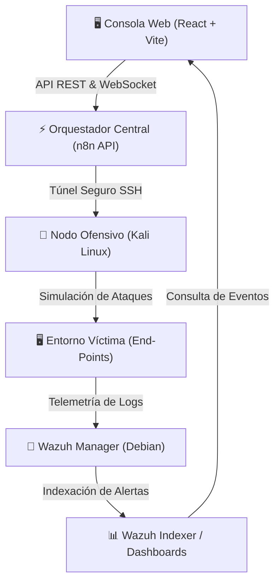

# 🛡️ CyberShield Pro - SIEM Wazuh & Emulación de Adversarios

[](https://react.dev/)
[](https://www.typescriptlang.org/)
[](https://n8n.io/)
[](https://www.mongodb.com/)
[](https://wazuh.com/)
[](https://www.kali.org/)

CyberShield Pro es una plataforma integral de **auditoría defensiva y emulación de adversarios** diseñada para evaluar la resiliencia en infraestructuras corporativas. La solución automatiza el ciclo completo de validación de seguridad: desde la instanciación controlada de vectores ofensivos hasta la ingesta, correlación y clasificación de alertas dentro del motor SIEM Wazuh de acuerdo al marco normativo internacional.

---

## 🖥️ Topología de la Arquitectura



---

## 🚀 Características Clave

### 1. Módulo Ofensivo (Simulaciones Bajo Demanda)
- **15 Vectores de Ataque Documentados**: Mapeados conforme a la matriz **MITRE ATT&CK** (capa 2 LAN, inyección Scapy, fuerza bruta SSH/Web, escalada de privilegios local y ataques de dominio Active Directory/Kerberos).
- **Consola de Comando SSH Interactiva**: Conexión remota segura con el nodo atacante Kali Linux (`192.168.1.150`), permitiendo el lanzamiento y monitorización de scripts (Scapy, Medusa, Hydra, macof, yersinia) en tiempo real con buffers de log interactivos.

### 2. Módulo Defensivo (Validación y Correlación SIEM)
- **Reglas de Correlación a Medida**: Firma y decodificadores XML unificados (`local_rules.xml`) en el Wazuh Manager para la detección precisa del comportamiento de intrusión simulado.
- **Wazuh Security Overview**: Interfaz integrada que simula el estado de seguridad de los agentes, KPIs de severidad y alertas en tiempo real extraídas del Indexer.

### 3. Generador de Reportes Técnicos
- **Generador PDF Premium**: Exportación automática de informes de intrusión con detalles del vector, nivel de riesgo detectado, logs de Wazuh involucrados y contramedidas recomendadas.

---

## 🛠️ Tecnologías Utilizadas

- **Frontend**: React 18, Vite, TailwindCSS, Three.js & OGL (animaciones WebGL en fondo y radar interactivo).
- **Backend**: Node.js, Express (seguridad mejorada con Rate Limiting, CORS, Helmet y JWT en Cookies Seguras).
- **Base de Datos**: MongoDB & Mongoose (almacenamiento de plantillas de ataque y reportes).
- **Orquestación**: n8n Gateway para flujos de automatización asíncronos.
- **Entorno de Red**: Kali Linux v2026.1 y Wazuh SIEM v4.14.

---

## ⚙️ Despliegue del Entorno Local

### Requisitos Previos
- Node.js (v18 o superior)
- MongoDB en ejecución local o remota
- Conexión configurada con el nodo Kali Linux y Wazuh Manager

### 1. Configuración de Variables de Entorno (`.env`)
Crea un archivo `.env` en la raíz del proyecto basándote en [.env.example](file:///c:/Users/Alex%20gc/Desktop/CyberShield/.env.example):
```bash
MONGODB_URI=mongodb://localhost:27017/cybershield
JWT_SECRET=tu_jwt_secret_aqui
SESSION_SECRET=tu_session_secret_aqui
PORT=3001
SSH_HOST=192.168.1.150
SSH_USER=kali
SSH_PASS=kali
WAZUH_API_URL=https://10.10.10.49:55000
WAZUH_USER=admin
WAZUH_PASS=tu_password_wazuh
```

### 2. Instalación y Siembra de Plantillas
Instala las dependencias y corre el script de siembra para importar las 15 plantillas de ataque en MongoDB:
```bash
# Instalar dependencias del servidor backend
npm install

# Sembrar plantillas de ataque en la base de datos
npm run seed
```

### 3. Ejecución del Servidor Backend
Inicia el servidor Node.js que expone las APIs REST y WebSocket:
```bash
node server.js
```

### 4. Ejecución del Frontend (React + Vite)
Dirígete a la carpeta `lovable` e instala las dependencias de la consola web:
```bash
cd lovable
npm install
npm run dev
```
Accede a la consola web en el navegador a través de `http://localhost:8080` (el proxy Vite redirigirá las llamadas de API al backend en el puerto `3001`).

---

## 📄 Licencia
Este proyecto es un Trabajo de Fin de Grado y se expone con fines exclusivamente didácticos y de auditoría de seguridad controlada en laboratorios de ciberseguridad.
